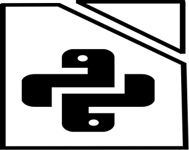

### 📢 News

  
Spliterpy를 소개합니다.

  ## Spliterpy를 소개합니다.

  

  
  
  
  CSV 파일을 특정 지점마다 각각 잘라 저장하는 프로그램을 Pandas와 PySide2를 이용하여 제작 후 [itch.io](https://kaintels.itch.io/spliterpy)에 무료배포하였습니다.
  

  
2019 1st ML month with KaKR Top 50% 진입

  ## 🏆 2019 1st ML month with KaKR Top 50% 진입

  

  
  캐글 코리아가 주관하고, 구글 코리아에서 후원한 제1회 캐글 코리아 대회에서 상위 50% 이내에 포함되어 소정의 상품을 받았습니다.
  [[Leaderboard 확인 (**153rd** of 349)]](https://www.kaggle.com/c/2019-1st-ml-month-with-kakr/leaderboard)
  

  
커리어 및 활동

  ## 🔭 커리어

  - 삼육대학교 카메카트로닉스학과 공학사 (2019. 02.)
  - 광운대학교 지능정보시스템 임베디드 SW공학과 [석사과정](http://bcml.kw.ac.kr/) (2019. 03. ~)
  - [주식회사 두두아이티](http://www.duduit.co.kr/) AI 및 보안 연구원 입사 (2020. 12. ~)
  
  ## 👯 활동
  
  - 삼육대학교 창업기업 [Madein](https://made-in.co.kr/) 머신러닝 멘토
  - 자작자동차 동아리 [Team Mad for Speed](https://www.facebook.com/teammfs) 자율주행자동차 멘토
  - [machine-learning](https://github.com/teddylee777/machine-learning) 깃허브 리포지토리 기여자 
  - [awesome-activity](https://github.com/FKgk/awesome-activity) 깃허브 리포지토리 기여자

---------------

### Seungwoo Han @Kaintels

 

 

---------------
### :octocat: My Github Stats

<!--

-->

<table id="stats"><tr><td valign="top" width="50%">

</td>
<td valign="top" width="50%">

</td></tr>
</table>  
